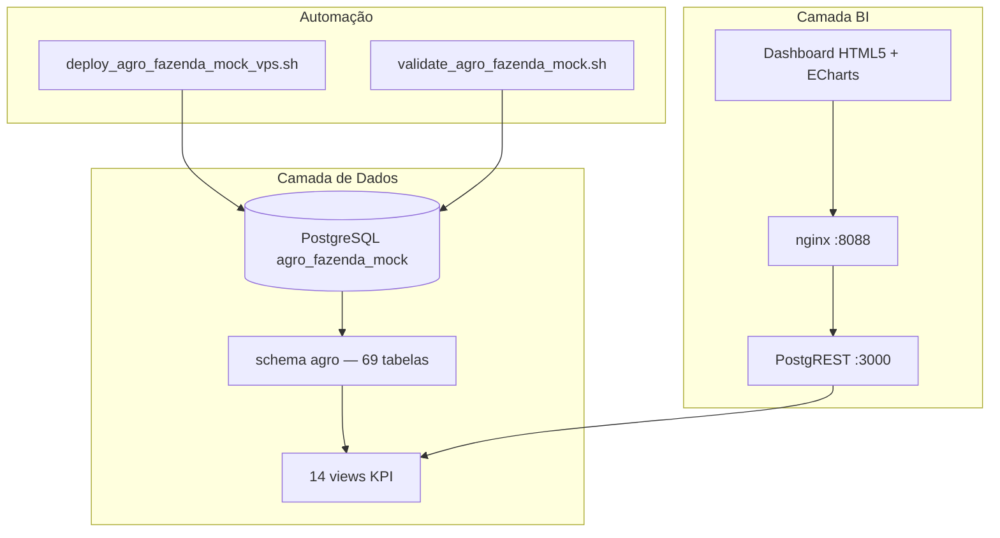
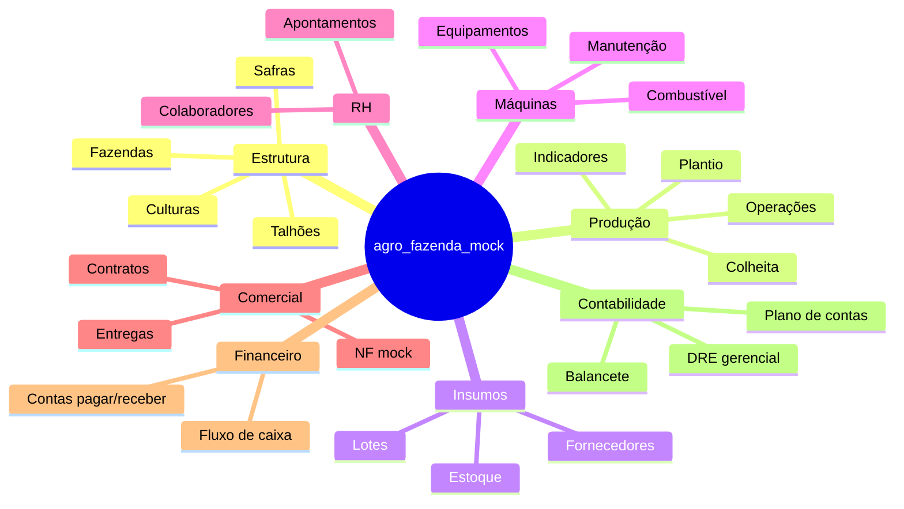

# bi-fazenda-mock

> Base de dados mock agrícola em PostgreSQL + dashboard BI em HTML5/CSS/JavaScript para análise de produção, custos, financeiro e contabilidade de uma fazenda fictícia.

[](https://www.postgresql.org/)
[](https://postgrest.org/)
[](bi/)
[](docs/deploy-agro-fazenda-mock-postgresql.md)

Sistema completo de **Business Intelligence agrícola** com dados fictícios coerentes da **Fazenda Boa Esperança Agro Ltda.** (Rio Verde/GO), cobrindo soja, milho, sorgo, feijão e café — do plantio à contabilidade.

---

## Visão geral



| Métrica | Valor |
|---------|-------|
| Tabelas | **69** |
| Views analíticas | **14** |
| Talhões mock | **20** |
| Culturas | **5** (soja, milho, sorgo, feijão, café) |
| Insumos | **35+** |
| Lançamentos contábeis | **8** (partidas dobradas balanceadas) |

---

## Domínios modelados



---

## Dashboard BI

Interface web responsiva com **6 seções analíticas**:

| Seção | Conteúdo |
|-------|----------|
| **Visão Geral** | KPIs de receita, resultado, produtividade e gráfico por cultura |
| **Produção** | Produtividade por talhão (ranking + tabela) |
| **Custos** | Custo/hectare e margem bruta por cultura |
| **Estoques** | Insumos e produção armazenada |
| **Financeiro** | Fluxo de caixa com saldo acumulado |
| **Contabilidade** | DRE gerencial por cultura |

**Stack frontend:** HTML5 semântico · CSS Grid/Flexbox · vanilla JavaScript (ES modules) · [Apache ECharts](https://echarts.apache.org/)

---

## Início rápido

### 1. Clonar o repositório

```bash
git clone https://github.com/hsavios/bi-fazenda-mock.git
cd bi-fazenda-mock
```

### 2. Provisionar o banco (VPS)

Requisitos: Docker com container `postgres` (`postgres:16`) em `127.0.0.1:5432`.

```bash
chmod +x scripts/*.sh
./scripts/deploy_agro_fazenda_mock_vps.sh --yes
```

Credenciais geradas em `~/.secrets/agro_fazenda_mock.env` (chmod 600).

### 3. Subir o dashboard BI

```bash
./scripts/deploy_bi_vps.sh
```

Acesse: **http://127.0.0.1:8088**

---

## Estrutura do projeto

```
bi-fazenda-mock/
├── database/agro_fazenda_mock/   # SQL modular + consolidado
│   ├── 00_drop_create_schema.sql
│   ├── 01_schema.sql             # DDL — 69 tabelas
│   ├── 02_seed_master_data.sql   # Cadastros mestres
│   ├── 03_seed_operational_data.sql
│   ├── 04_views_kpis.sql         # 14 views BI
│   ├── 05_validation_queries.sql
│   └── agro_fazenda_mock_full.sql  # gerado automaticamente
├── scripts/
│   ├── deploy_agro_fazenda_mock_vps.sh   # deploy completo
│   ├── validate_agro_fazenda_mock.sh
│   ├── build_agro_fazenda_mock_full.sh
│   └── deploy_bi_vps.sh
├── bi/                           # Dashboard HTML5/CSS/JS
│   ├── index.html
│   ├── css/styles.css
│   └── js/{api,app}.js
├── docs/                         # Guias e relatório técnico
├── docker-compose.bi.yml         # PostgREST + nginx
└── logs/                         # logs de deploy (gitignored)
```

---

## Views KPI disponíveis

| View | Descrição |
|------|-----------|
| `vw_custo_hectare_cultura_safra` | Custo por hectare |
| `vw_custo_saca_cultura_safra` | Custo por saca |
| `vw_resultado_gerencial_cultura` | Resultado por cultura |
| `vw_resultado_talhao` | Resultado estimado por talhão |
| `vw_estoque_insumos_atual` | Posição de estoque de insumos |
| `vw_estoque_producao_atual` | Estoque de grãos/café |
| `vw_uso_maquinas_safra` | Horas e custo de máquinas |
| `vw_horas_mao_obra_safra` | Mão de obra por safra |
| `vw_fluxo_caixa_realizado` | Fluxo de caixa com saldo |
| `vw_balancete_contabil` | Balancete mensal |
| `vw_dre_gerencial` | DRE por cultura/safra |
| `vw_margem_bruta_cultura` | Margem bruta |
| `vw_produtividade_talhao` | Produtividade sc/ha |
| `vw_comercializacao_cultura` | Contratos e entregas |

---

## Segurança e isolamento

- Banco **independente**: `agro_fazenda_mock` (não interfere em outros bancos)
- Usuário dedicado: `agro_mock_user`
- Schema dedicado: `agro`
- Guard clause impede execução acidental fora do banco correto
- Deploy **bloqueia** uso do container `gesto-app-postgres-1`
- BI usa role read-only `agro_mock_readonly` via PostgREST

---

## Scripts — referência

```bash
# Deploy completo (exige --yes para DROP SCHEMA)
./scripts/deploy_agro_fazenda_mock_vps.sh --yes

# Opções adicionais
./scripts/deploy_agro_fazenda_mock_vps.sh --yes --reset-password
./scripts/deploy_agro_fazenda_mock_vps.sh --yes --skip-validation

# Validar integridade
./scripts/validate_agro_fazenda_mock.sh

# Regenerar SQL consolidado
./scripts/build_agro_fazenda_mock_full.sh
```

---

## Documentação

- [Guia de deploy na VPS](docs/deploy-agro-fazenda-mock-postgresql.md)
- [Relatório de implementação](docs/relatorio-implementacao-agro-fazenda-mock.md)
- [Modelo do banco](database/agro_fazenda_mock/README.md)
- [Dashboard BI](bi/README.md)

---

## Dados fictícios

Todos os dados são **fictícios** e não representam pessoas ou empresas reais.

| Entidade | Exemplo |
|----------|---------|
| Fazenda | Fazenda Boa Esperança Agro Ltda. |
| Localização | Rio Verde, GO |
| Safras | 2023/24, 2024/25, 2025/26 |
| Área total | ~4.850 ha |

---

## Licença

Projeto de demonstração / estudo. Uso livre para fins educacionais e de prototipagem de BI agrícola.

---

<p align="center">
  <strong>bi-fazenda-mock</strong> — do campo ao balancete, com dados mock prontos para BI
</p>
