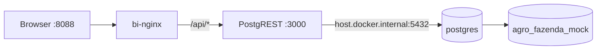

# Deploy do dashboard BI na VPS

Guia para subir PostgREST + nginx do projeto `agro-fazenda-mock` na VPS `srv1535465`.

## Pré-requisitos

- Banco `agro_fazenda_mock` provisionado e validado
- Credenciais em `~/.secrets/agro_fazenda_mock.env`
- Container `postgres` rodando em `127.0.0.1:5432`
- Docker Compose disponível

## Deploy

```bash
cd /home/helio/projects/agro-fazenda-mock
git pull
chmod +x scripts/*.sh scripts/lib/*.sh
./scripts/deploy_bi_vps.sh
```

## O que o script faz

1. Carrega credenciais (`AGRO_USER`, `AGRO_PASS`, etc.)
2. Reaplica permissões (`grant_agro_fazenda_mock.sh`) incluindo role `agro_mock_readonly`
3. Gera `.env.bi` com `PGRST_DB_URI` (não commitar)
4. Sobe `fazenda-mock-postgrest` e `fazenda-mock-bi-nginx`
5. Aguarda PostgREST em `http://127.0.0.1:3000`
6. Valida endpoints com `validate_bi_vps.sh`

## Acesso

| Serviço | URL |
|---------|-----|
| Dashboard BI | http://127.0.0.1:8088 |
| PostgREST (direto) | http://127.0.0.1:3000 |
| API via nginx | http://127.0.0.1:8088/api/ |

Exemplo:

```bash
curl -s "http://127.0.0.1:8088/api/vw_dre_gerencial?limit=3" | head
```

## Validação manual

```bash
./scripts/validate_bi_vps.sh
```

## Parar / reiniciar

```bash
docker compose -f docker-compose.bi.yml down
docker compose -f docker-compose.bi.yml up -d
```

## Arquitetura



PostgREST conecta como `agro_mock_user` e executa queries com a role read-only `agro_mock_readonly` nas views do schema `agro`.

## Troubleshooting

### PostgREST não sobe

```bash
docker compose -f docker-compose.bi.yml logs postgrest
```

Causas comuns:

- Senha incorreta em `~/.secrets/agro_fazenda_mock.env`
- `agro_mock_readonly` sem `SELECT` nas views → rode `./scripts/grant_agro_fazenda_mock.sh`
- PostgreSQL não acessível em `host.docker.internal:5432`

### Dashboard abre mas API falha

Verifique o proxy nginx:

```bash
curl -s http://127.0.0.1:3000/vw_dre_gerencial?limit=1
curl -s http://127.0.0.1:8088/api/vw_dre_gerencial?limit=1
```

### Porta em uso

```bash
ss -tlnp | grep -E '3000|8088'
BI_PGRST_PORT=3010 BI_NGINX_PORT=8090 ./scripts/deploy_bi_vps.sh
```

### PostgREST retorna 503

O banco ainda não está acessível. Verifique:

```bash
docker port postgres 5432/tcp
docker compose -f docker-compose.bi.yml logs postgrest
./scripts/grant_agro_fazenda_mock.sh
```

O script detecta automaticamente:
- porta publicada do PostgreSQL (`host.docker.internal`)
- rede Docker compartilhada
- IP do container (fallback)

## Segurança

- PostgREST exposto apenas em `127.0.0.1` (localhost da VPS)
- Role `agro_mock_readonly` com `SELECT` apenas
- Para acesso externo, use túnel SSH ou reverse proxy com autenticação

```bash
# Exemplo: túnel do seu PC para a VPS
ssh -L 8088:127.0.0.1:8088 helio@srv1535465
```

Depois abra http://127.0.0.1:8088 no navegador local.
