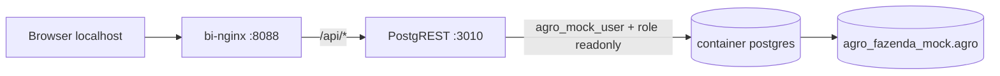

# Deploy do dashboard BI na VPS

Guia para subir PostgREST + nginx do projeto `agro-fazenda-mock` na VPS `srv1535465`.

## Portas na VPS (importante)

Na VPS, a porta **3000** costuma estar ocupada por `gesto-app-frontend-1` (`127.0.0.1:3000->8080`).

**Não use a porta 3000** para o BI deste projeto.

| Serviço | Porta padrão | Alternativa |
|---------|--------------|-------------|
| PostgREST | `127.0.0.1:3010` | outra livre |
| nginx/dashboard | `127.0.0.1:8088` | `8090` se 8088 ocupada |

Bind sempre em **`127.0.0.1`** — nunca `0.0.0.0`.

## Pré-requisitos

- Banco `agro_fazenda_mock` validado (69 tabelas, 14 views)
- Credenciais em `~/.secrets/agro_fazenda_mock.env`
- Container **`postgres`** rodando (não usar `gesto-app-postgres-1`)
- Docker Compose disponível

## Sequência recomendada na VPS

```bash
cd /home/helio/projects/agro-fazenda-mock
git pull
git rev-parse --short HEAD
chmod +x scripts/*.sh scripts/lib/*.sh

# Conferir portas antes do deploy
ss -tlnp | grep -E '3000|3010|8088|8090' || true

# Deploy (portas padrão já são 3010/8088 a partir do commit pós-auditoria)
BI_PGRST_PORT=3010 BI_NGINX_PORT=8088 ./scripts/deploy_bi_vps.sh

# Validar
./scripts/validate_bi_vps.sh

docker ps --format "table {{.Names}}\t{{.Status}}\t{{.Ports}}" | grep -E 'fazenda|postgrest|bi|nginx'

curl -i http://127.0.0.1:8088/
curl -s "http://127.0.0.1:8088/api/vw_dre_gerencial?limit=1" | head
```

Se **8088** estiver ocupada:

```bash
BI_PGRST_PORT=3010 BI_NGINX_PORT=8090 ./scripts/deploy_bi_vps.sh
./scripts/validate_bi_vps.sh
curl -i http://127.0.0.1:8090/
curl -s "http://127.0.0.1:8090/api/vw_dre_gerencial?limit=1" | head
```

## O que o script faz

1. Bloqueia uso de `gesto-app-postgres-1`
2. Detecta conexão ao PostgreSQL `postgres`:
   - **preferência:** porta publicada `127.0.0.1:5432` → `host.docker.internal` (via `extra_hosts: host-gateway`)
   - **fallback:** rede Docker compartilhada ou IP do container
3. Reaplica permissões (`grant_agro_fazenda_mock.sh`)
4. Restringe `agro_mock_readonly` a **SELECT somente nas 14 views KPI**
5. Gera `.env.bi` com portas e URI (não commitar)
6. Sobe `fazenda-mock-postgrest` e `fazenda-mock-bi-nginx`
7. Valida HTTP 200 + permissões readonly

## Arquitetura



### PostgREST — papéis

| Papel | Função |
|-------|--------|
| `agro_mock_user` | Autenticador na URI de conexão |
| `agro_mock_readonly` | Role anônima (`PGRST_DB_ANON_ROLE`) — somente `SELECT` em views |

### Conexão PostgreSQL no Linux

`docker-compose.bi.yml` define:

```yaml
extra_hosts:
  - "host.docker.internal:host-gateway"
```

Isso funciona no Docker moderno do Linux. O script prioriza `host.docker.internal` quando `docker port postgres 5432` retorna `127.0.0.1:5432`.

## Segurança

- Serviços BI escutam **apenas** em `127.0.0.1`
- `agro_mock_readonly`: `SELECT` **somente nas views KPI** (tabelas operacionais revogadas)
- Sem domínio público / sem Cloudflare / sem nginx global
- Não altera containers de outros projetos

## Parar o BI (rollback rápido)

```bash
cd /home/helio/projects/agro-fazenda-mock
docker compose -f docker-compose.bi.yml down
# se existir override de rede:
docker compose -f docker-compose.bi.yml -f docker-compose.bi.override.yml down 2>/dev/null || true
```

Isso remove apenas `fazenda-mock-postgrest` e `fazenda-mock-bi-nginx`.

## Túnel SSH (acesso do seu PC)

```bash
ssh -L 8088:127.0.0.1:8088 helio@srv1535465
```

Abra http://127.0.0.1:8088 no navegador local.

## Troubleshooting

### Porta 3000 ocupada

Esperado na VPS. Use `BI_PGRST_PORT=3010` (já é o padrão).

### PostgREST 503

```bash
docker compose -f docker-compose.bi.yml logs postgrest
docker port postgres 5432/tcp
./scripts/grant_agro_fazenda_mock.sh
```

### validate_bi_vps.sh falha em portas

O script lê portas de `.env.bi` gerado pelo deploy. Rode o deploy antes ou exporte:

```bash
export BI_PGRST_PORT=3010 BI_NGINX_PORT=8088
./scripts/validate_bi_vps.sh
```
