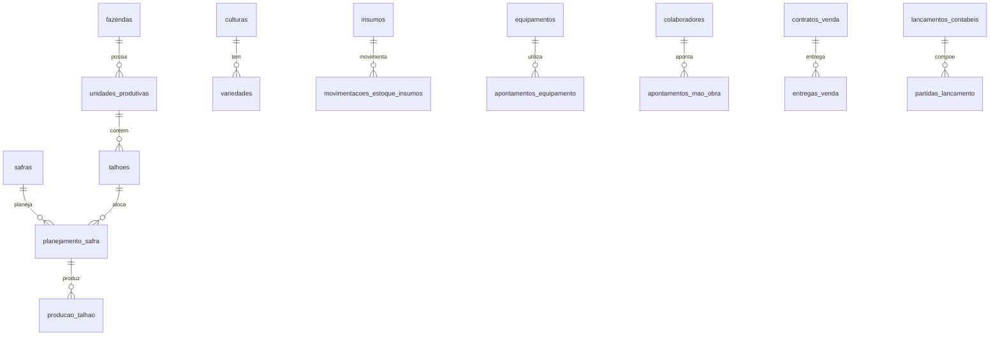

# Modelo de dados — agro_fazenda_mock

Documentação da modelagem do schema `agro` no banco PostgreSQL `agro_fazenda_mock`.

**Fazenda fictícia:** Boa Esperança Agro Ltda. — Rio Verde/GO  
**Culturas:** soja, milho, sorgo, feijão, café

---

## Visão geral

O schema `agro` modela uma operação agrícola integrada com rastreabilidade entre estrutura física, safras, operações de campo, insumos, máquinas, pessoas, estoques, comercialização, financeiro, custos e contabilidade.

---

## 1. Estrutura da fazenda

| Tabela | Descrição |
|--------|-----------|
| `fazendas` | Cadastro da propriedade (CNPJ, município, área total) |
| `unidades_produtivas` | Divisões operacionais (grãos, café, mista) |
| `talhoes` | Parcelas de terra com área, coordenadas e tipo de solo |
| `historico_uso_solo` | Rotação de culturas por talhão e safra |
| `analises_solo` | Resultados de laboratório e recomendações |

**Relacionamento:** `fazendas` → `unidades_produtivas` → `talhoes`

---

## 2. Safras e culturas

| Tabela | Descrição |
|--------|-----------|
| `culturas` | Soja, milho, sorgo, feijão, café |
| `variedades` | Cultivares com ciclo e produtividade esperada |
| `safras` | Períodos agrícolas (ex.: 2023/24, 2024/25) |
| `planejamento_safra` | Alocação cultura × talhão × safra |

---

## 3. Talhões

Os talhões são a unidade geográfica central para custos, produção e indicadores agronômicos. Cada talhão pertence a uma unidade produtiva e recebe planejamento, operações, colheita e custeio individualizado.

---

## 4. Produção

| Tabela | Descrição |
|--------|-----------|
| `operacoes_agricolas` | Tipos de operação (plantio, pulverização, colheita) |
| `ordens_servico` | Ordens de execução por safra/talhão |
| `execucoes_operacao` | Registro de execução com datas |
| `plantios` | Detalhes de plantio (variedade, população) |
| `aplicacoes_insumos` | Aplicação de defensivos/fertilizantes |
| `colheitas` | Registro de colheita |
| `producao_talhao` | Produção em sacas por talhão |
| `perdas_producao` | Perdas registradas |
| `indicadores_agronomicos` | KPIs de campo |

---

## 5. Insumos

| Tabela | Descrição |
|--------|-----------|
| `unidades_medida` | kg, L, sc, etc. |
| `categorias_insumo` | Fertilizantes, defensivos, sementes |
| `fornecedores` | Cadastro de fornecedores |
| `insumos` | Catálogo de produtos |
| `lotes_insumo` | Rastreabilidade por lote |
| `armazens` | Locais de armazenamento |
| `estoque_insumos` | Posição por armazém/insumo |
| `movimentacoes_estoque_insumos` | Entradas, saídas e ajustes |

---

## 6. Máquinas e equipamentos

| Tabela | Descrição |
|--------|-----------|
| `categorias_equipamento` | Tratores, pulverizadores, colheitadeiras |
| `equipamentos` | Frota com horímetro e custo |
| `custo_hora_equipamento` | Custo/hora por período |
| `manutencoes_equipamento` | Ordens de manutenção |
| `consumo_combustivel` | Abastecimentos |
| `apontamentos_equipamento` | Horas por operação/safra |

---

## 7. Recursos humanos

| Tabela | Descrição |
|--------|-----------|
| `cargos` | Funções (operador, agrônomo, etc.) |
| `colaboradores` | Cadastro de pessoas |
| `equipes` | Agrupamentos operacionais |
| `custo_hora_colaborador` | Custo/hora por colaborador |
| `apontamentos_mao_obra` | Horas por operação |

---

## 8. Operações agrícolas

O fluxo operacional conecta `ordens_servico` → `execucoes_operacao` → apontamentos de máquina/mão de obra e consumo de insumos, permitindo custeio por operação e por talhão.

---

## 9. Estoques de produção

| Tabela | Descrição |
|--------|-----------|
| `lotes_producao` | Lotes colhidos |
| `classificacao_producao` | Qualidade (umidade, impureza) |
| `estoque_producao` | Posição de grãos/café |
| `movimentacoes_estoque_producao` | Entradas e saídas |
| `beneficiamento_producao` | Beneficiamento/secagem |

---

## 10. Comercialização

| Tabela | Descrição |
|--------|-----------|
| `clientes` | Compradores |
| `contratos_venda` | Contratos por cultura/safra |
| `entregas_venda` | Entregas contra contrato |
| `notas_fiscais_mock` | NF fictícias |
| `recebimentos_venda` | Recebimentos vinculados |

---

## 11. Financeiro

| Tabela | Descrição |
|--------|-----------|
| `centros_custo` | Centros de custo |
| `categorias_financeiras` | Classificação de fluxo |
| `contas_bancarias` | Contas da fazenda |
| `contas_pagar` | Obrigações |
| `contas_receber` | Direitos |
| `pagamentos` / `recebimentos` | Baixas |
| `fluxo_caixa` | Movimentação consolidada |

---

## 12. Custos

| Tabela | Descrição |
|--------|-----------|
| `apropriacoes_custo` | Rateio de custos |
| `custos_planejados` | Orçamento |
| `custos_realizados` | Realizado |
| `rateios_custo` | Regras de rateio |
| `custo_por_talhao` | Custeio por talhão |
| `custo_por_cultura` | Custeio por cultura |
| `custo_por_operacao` | Custeio por operação |

---

## 13. Contabilidade

| Tabela | Descrição |
|--------|-----------|
| `plano_contas` | Plano de contas gerencial |
| `historicos_padrao` | Históricos padrão |
| `lancamentos_contabeis` | Cabeçalho dos lançamentos |
| `partidas_lancamento` | Partidas de débito/crédito |
| `fechamentos_contabeis` | Fechamentos mensais |
| `balancetes` | Balancete por período |
| `dre_gerencial` | DRE por cultura/safra |

**Regra:** todo lançamento contábil deve ter débito = crédito (partidas dobradas).

> **Versão anterior na VPS:** algumas instalações usam `lancamento_contabil` + `lancamento_contabil_item`. Os scripts de validação detectam automaticamente qual modelo está ativo.

---

## 14. Views analíticas

Views para BI e relatórios (prefixo `vw_` na versão atual do repositório):

| View | Descrição |
|------|-----------|
| `vw_custo_hectare_cultura_safra` | Custo por hectare |
| `vw_custo_saca_cultura_safra` | Custo por saca |
| `vw_resultado_gerencial_cultura` | Resultado por cultura |
| `vw_resultado_talhao` | Resultado estimado por talhão |
| `vw_estoque_insumos_atual` | Posição de insumos |
| `vw_estoque_producao_atual` | Estoque de grãos/café |
| `vw_uso_maquinas_safra` | Horas e custo de máquinas |
| `vw_horas_mao_obra_safra` | Mão de obra por safra |
| `vw_fluxo_caixa_realizado` | Fluxo de caixa |
| `vw_balancete_contabil` | Balancete mensal |
| `vw_dre_gerencial` | DRE gerencial |
| `vw_margem_bruta_cultura` | Margem bruta |
| `vw_produtividade_talhao` | Produtividade sc/ha |
| `vw_comercializacao_cultura` | Contratos e entregas |

---

## Arquivos SQL

| Arquivo | Conteúdo |
|---------|----------|
| `00_drop_create_schema.sql` | DROP/CREATE schema `agro` |
| `01_schema.sql` | DDL completo |
| `02_seed_master_data.sql` | Cadastros mestres |
| `03_seed_operational_data.sql` | Dados operacionais |
| `04_views_kpis.sql` | Views + role read-only |
| `05_validation_queries.sql` | Queries de integridade |
| `agro_fazenda_mock_full.sql` | Consolidado (gerado automaticamente) |
